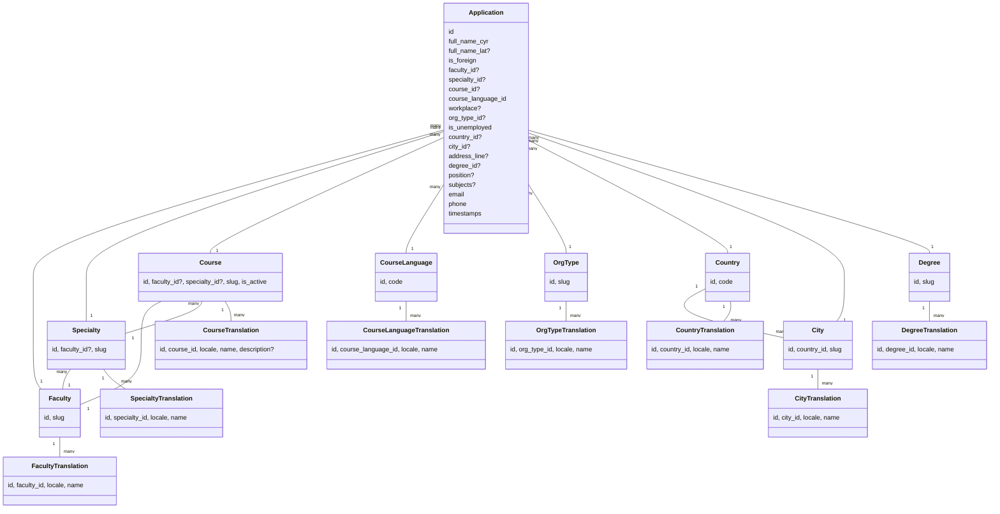
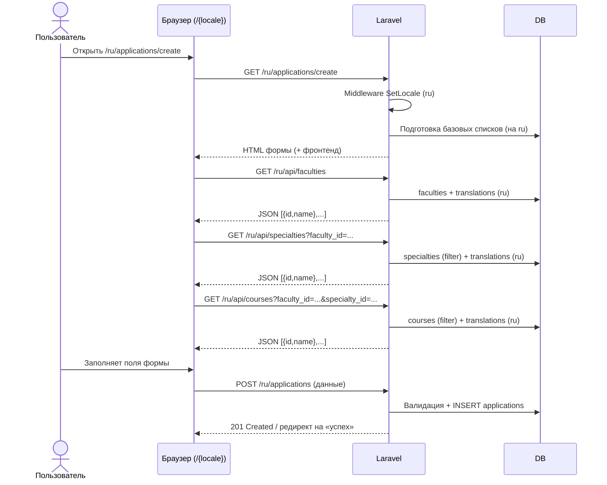

# Мультиязычная анкета (Laravel)

на трех языках будет будет хранится данные , например если по url выбрал /ru то выйдет на русском -- зависит от выбраноого языка выйдет форма , но и в бд как решить с сохранением данных с выбранном языком не знаю
Ф.И.О. (на кириллице)  
Ф.И.О. (на латинице)  
Вы Иностранный гражданин ?: да/нет  
Если учится : По какому направлению желаете пройти курс (список Факультетов)   /// будет список и список получает через бд

**Специальность**  /// будет список и список получает через бд --- для каждого факултета есть специальность
По какому **Курсу** желаете повысить квалификацию ? /// будет список Курсов,

Список  которые уже возможно существует 

Сами курсы могут работать без свяки Факультету и **Специальность** 

то есть админ может создавать курсы которые зависит от Факультета и Специализации

Если админ не выбрал Факультет и Специализации то можно пропустить пропускается 

Язык прохождения курса (казахский/русский/английский)  /// тоже с бд   

 Место работы, адрес: Где он рабоатет есть вариант : Не работаю 
в какой Стране находится : Казахстан пока что только казахстан ,все города казахтана
в каком городе : Алматы --- список городов 
тип  Образовательные организациях: Школа  : список тип организации  ---  Образовательные организациях (вуз/школа/колледж/другое) // будет список и список получает через бд
где находся Адрес: ул. Сейфуллина, д. 12/// вводит пользователь

**Ученая степень  , выбирает список который будет загружаться с бд** 

**Занимаемая должность  , пользователь сам вводит**

 Преподаваемые предметы   /// пользватель сам вводит
E-mail  
Мобильный телефон  

Как будет работать во всех таблицах мультиязычность на разных языках не знаю , надо тоже подумать 

Нужно создать Модели Факультетов и **Специальностей** 

Модель Стран , городов  пока что только Казахстан и егго города

Модбель Образовательные организациях: Школа  : список тип организации
## Ключевые идеи

- Мультиязычные справочники (факультеты, специальности, курсы, страны, города, типы организаций, учёные степени, **языки прохождения курса**) хранятся в отдельных таблицах с таблицами переводов (`*_translations`).
- Пользовательские поля (ФИО, адрес, телефон и т.п.) **не переводятся** — сохраняются как введены.
- Курсы могут быть:
  - привязаны к факультету и/или специальности;
  - **не привязаны** ни к чему (по ТЗ).
- Язык интерфейса берётся из префикса URL `/{locale}` (`ru|kk|en`) через middleware.
- Списки подтягиваются через JSON-эндпоинты с учётом текущего `locale`.

---

## ER-диаграмма (mermaid)


 
---

## Последовательность взаимодействия (mermaid)



---

## Middleware: установка локали

`app/Http/Middleware/SetLocale.php`
```php
<?php

namespace App\Http\Middleware;

use Closure;
use Illuminate\Support\Facades\App;

class SetLocale
{
    public function handle($request, Closure $next)
    {
        $locale = $request->route('locale') ?? 'ru';
        if (!in_array($locale, ['ru','kk','en'])) {
            $locale = 'ru';
        }
        App::setLocale($locale);
        return $next($request);
    }
}
```

`app/Http/Kernel.php` (фрагмент регистрации)
```php
protected $routeMiddleware = [
    // ...
    'set.locale' => \App\Http\Middleware\SetLocale::class,
];
```

---

## Трейт для переводов

`app/Models/Concerns/HasTranslations.php`
```php
<?php

namespace App\Models\Concerns;

use Illuminate\Database\Eloquent\Relations\HasMany;
use Illuminate\Support\Facades\App;

trait HasTranslations
{
    public function translations(): HasMany
    {
        return $this->hasMany($this->translationModel());
    }

    public function translationModel(): string
    {
        // Например: App\Models\Faculty => App\Models\FacultyTranslation
        return static::class.'Translation';
    }

    // Унифицированный доступ к name с учётом текущего locale
    public function getNameAttribute(): ?string
    {
        $locale = App::getLocale();
        $translations = $this->relationLoaded('translations')
            ? $this->translations
            : $this->translations()->get();

        $tr = $translations->firstWhere('locale', $locale)
           ?? $translations->firstWhere('locale', 'ru')
           ?? $translations->first();

        return $tr?->name;
    }
}
```

---

## Модели

`app/Models/Faculty.php`
```php
<?php

namespace App\Models;

use Illuminate\Database\Eloquent\Model;
use App\Models\Concerns\HasTranslations;

class Faculty extends Model
{
    use HasTranslations;

    protected $fillable = ['slug'];

    public function specialties()
    {
        return $this->hasMany(Specialty::class);
    }
}

class FacultyTranslation extends Model
{
    public $timestamps = false;
    protected $fillable = ['faculty_id','locale','name'];

    public function faculty()
    {
        return $this->belongsTo(Faculty::class);
    }
}
```

`app/Models/Specialty.php`
```php
<?php

namespace App\Models;

use Illuminate\Database\Eloquent\Model;
use App\Models\Concerns\HasTranslations;

class Specialty extends Model
{
    use HasTranslations;

    protected $fillable = ['faculty_id','slug'];

    public function faculty()
    {
        return $this->belongsTo(Faculty::class);
    }
}

class SpecialtyTranslation extends Model
{
    public $timestamps = false;
    protected $fillable = ['specialty_id','locale','name'];

    public function specialty()
    {
        return $this->belongsTo(Specialty::class);
    }
}
```

`app/Models/Course.php`
```php
<?php

namespace App\Models;

use Illuminate\Database\Eloquent\Model;
use App\Models\Concerns\HasTranslations;

class Course extends Model
{
    use HasTranslations;

    protected $fillable = ['faculty_id','specialty_id','slug','is_active'];

    public function faculty()
    {
        return $this->belongsTo(Faculty::class);
    }

    public function specialty()
    {
        return $this->belongsTo(Specialty::class);
    }
}

class CourseTranslation extends Model
{
    public $timestamps = false;
    protected $fillable = ['course_id','locale','name','description'];

    public function course()
    {
        return $this->belongsTo(Course::class);
    }
}
```

`app/Models/Country.php`
```php
<?php

namespace App\Models;

use Illuminate\Database\Eloquent\Model;
use App\Models\Concerns\HasTranslations;

class Country extends Model
{
    use HasTranslations;

    protected $fillable = ['code'];

    public function cities()
    {
        return $this->hasMany(City::class);
    }
}

class CountryTranslation extends Model
{
    public $timestamps = false;
    protected $fillable = ['country_id','locale','name'];

    public function country()
    {
        return $this->belongsTo(Country::class);
    }
}
```

`app/Models/City.php`
```php
<?php

namespace App\Models;

use Illuminate\Database\Eloquent\Model;
use App\Models\Concerns\HasTranslations;

class City extends Model
{
    use HasTranslations;

    protected $fillable = ['country_id','slug'];

    public function country()
    {
        return $this->belongsTo(Country::class);
    }
}

class CityTranslation extends Model
{
    public $timestamps = false;
    protected $fillable = ['city_id','locale','name'];

    public function city()
    {
        return $this->belongsTo(City::class);
    }
}
```

`app/Models/OrgType.php`
```php
<?php

namespace App\Models;

use Illuminate\Database\Eloquent\Model;
use App\Models\Concerns\HasTranslations;

class OrgType extends Model
{
    use HasTranslations;

    protected $fillable = ['slug'];
}

class OrgTypeTranslation extends Model
{
    public $timestamps = false;
    protected $fillable = ['org_type_id','locale','name'];

    public function orgType()
    {
        return $this->belongsTo(OrgType::class);
    }
}
```

`app/Models/Degree.php`
```php
<?php

namespace App\Models;

use Illuminate\Database\Eloquent\Model;
use App\Models\Concerns\HasTranslations;

class Degree extends Model
{
    use HasTranslations;

    protected $fillable = ['slug'];
}

class DegreeTranslation extends Model
{
    public $timestamps = false;
    protected $fillable = ['degree_id','locale','name'];

    public function degree()
    {
        return $this->belongsTo(Degree::class);
    }
}
```

`app/Models/CourseLanguage.php`
```php
<?php

namespace App\Models;

use Illuminate\Database\Eloquent\Model;
use App\Models\Concerns\HasTranslations;

class CourseLanguage extends Model
{
    use HasTranslations;

    protected $fillable = ['code']; // 'ru','kk','en'
}

class CourseLanguageTranslation extends Model
{
    public $timestamps = false;
    protected $fillable = ['course_language_id','locale','name'];

    public function courseLanguage()
    {
        return $this->belongsTo(CourseLanguage::class);
    }
}
```

`app/Models/Application.php`
```php
<?php

namespace App\Models;

use Illuminate\Database\Eloquent\Model;

class Application extends Model
{
    protected $fillable = [
        'full_name_cyr','full_name_lat','is_foreign',
        'faculty_id','specialty_id','course_id','course_language_id',
        'workplace','org_type_id','is_unemployed','country_id','city_id','address_line',
        'degree_id','position','subjects','email','phone',
    ];

    public function faculty(){ return $this->belongsTo(Faculty::class); }
    public function specialty(){ return $this->belongsTo(Specialty::class); }
    public function course(){ return $this->belongsTo(Course::class); }
    public function courseLanguage(){ return $this->belongsTo(CourseLanguage::class); }
    public function orgType(){ return $this->belongsTo(OrgType::class); }
    public function country(){ return $this->belongsTo(Country::class); }
    public function city(){ return $this->belongsTo(City::class); }
    public function degree(){ return $this->belongsTo(Degree::class); }
}
```

---

## FormRequest для валидации

`app/Http/Requests/StoreApplicationRequest.php`
```php
<?php

namespace App\Http\Requests;

use Illuminate\Foundation\Http\FormRequest;

class StoreApplicationRequest extends FormRequest
{
    public function authorize(): bool
    {
        return true;
    }

    public function rules(): array
    {
        return [
            'full_name_cyr'     => ['required','string','max:255'],
            'full_name_lat'     => ['nullable','string','max:255'],
            'is_foreign'        => ['required','boolean'],

            'faculty_id'        => ['nullable','exists:faculties,id'],
            'specialty_id'      => ['nullable','exists:specialties,id'],
            'course_id'         => ['nullable','exists:courses,id'],

            'course_language_id'=> ['required','exists:course_languages,id'],

            'workplace'         => ['nullable','string','max:255'],
            'org_type_id'       => ['nullable','exists:org_types,id'],
            'is_unemployed'     => ['required','boolean'],

            'country_id'        => ['nullable','exists:countries,id'],
            'city_id'           => ['nullable','exists:cities,id'],
            'address_line'      => ['nullable','string','max:255'],

            'degree_id'         => ['nullable','exists:degrees,id'],
            'position'          => ['nullable','string','max:255'],
            'subjects'          => ['nullable','string'],

            'email'             => ['required','email','max:255'],
            'phone'             => ['required','string','max:32'],
        ];
    }
}
```

---

## Контроллер анкеты

`app/Http/Controllers/ApplicationController.php`
```php
<?php

namespace App\Http\Controllers;

use App\Http\Requests\StoreApplicationRequest;
use App\Models\{
    Application, Faculty, Specialty, Course,
    Country, City, OrgType, Degree, CourseLanguage
};
use Illuminate\Http\Request;

class ApplicationController extends Controller
{
    // Страница формы (если нужен Blade; списки можно подтягивать Ajax-ом)
    public function create()
    {
        // Базовые справочники можно отдать сразу (или все через /api/*)
        $orgTypes = OrgType::with('translations')->get()->map(fn($o)=>[
            'id'=>$o->id,'name'=>$o->name
        ]);

        $degrees  = Degree::with('translations')->get()->map(fn($d)=>[
            'id'=>$d->id,'name'=>$d->name
        ]);

        $courseLangs = CourseLanguage::with('translations')->get()->map(fn($l)=>[
            'id'=>$l->id,'name'=>$l->name,'code'=>$l->code
        ]);

        // Казахстан и его города
        $countryKz = Country::where('code','KZ')->first();
        $cities = $countryKz
            ? City::with('translations')->where('country_id',$countryKz->id)->get()->map(fn($c)=>['id'=>$c->id,'name'=>$c->name])
            : collect();

        // факультеты/спец-сти/курсы лучше получать Ajax-ом (динамические зависимости)
        return view('applications.create', compact('orgTypes','degrees','courseLangs','cities'));
    }

    // Сохранение анкеты
    public function store(StoreApplicationRequest $request)
    {
        $data = $request->validated();

        // если отмечено "Не работаю" — очищаем workplace/org_type_id
        if (!empty($data['is_unemployed'])) {
            $data['workplace'] = null;
            $data['org_type_id'] = null;
        }

        $application = Application::create($data);

        // Возврат JSON (если форма SPA) или редирект
        if ($request->wantsJson()) {
            return response()->json(['id'=>$application->id, 'message'=>'Заявка сохранена'], 201);
        }

        return redirect()->back()->with('status','Заявка сохранена');
    }
}
```

---

## API-контроллеры справочников

`app/Http/Controllers/Api/FacultiesController.php`
```php
<?php

namespace App\Http\Controllers\Api;

use App\Http\Controllers\Controller;
use App\Models\Faculty;

class FacultiesController extends Controller
{
    public function index()
    {
        $items = Faculty::with('translations')->get()
            ->map(fn($f)=>['id'=>$f->id,'name'=>$f->name]);
        return response()->json($items);
    }
}
```

`app/Http/Controllers/Api/SpecialtiesController.php`
```php
<?php

namespace App\Http\Controllers\Api;

use App\Http\Controllers\Controller;
use App\Models\Specialty;
use Illuminate\Http\Request;

class SpecialtiesController extends Controller
{
    public function index(Request $request)
    {
        $q = Specialty::with('translations');
        if ($request->filled('faculty_id')) {
            $q->where('faculty_id', (int)$request->faculty_id);
        }
        $items = $q->get()->map(fn($s)=>['id'=>$s->id,'name'=>$s->name]);
        return response()->json($items);
    }
}
```

`app/Http/Controllers/Api/CoursesController.php`
```php
<?php

namespace App\Http\Controllers\Api;

use App\Http\Controllers\Controller;
use App\Models\Course;
use Illuminate\Http\Request;

class CoursesController extends Controller
{
    public function index(Request $request)
    {
        $q = Course::with('translations')->where('is_active', true);

        if ($request->filled('faculty_id')) {
            $q->where('faculty_id', (int)$request->faculty_id);
        }
        if ($request->filled('specialty_id')) {
            $q->where('specialty_id', (int)$request->specialty_id);
        }

        $items = $q->get()->map(fn($c)=>['id'=>$c->id,'name'=>$c->name]);
        return response()->json($items);
    }
}
```

`app/Http/Controllers/Api/GeoController.php`
```php
<?php

namespace App\Http\Controllers\Api;

use App\Http\Controllers\Controller;
use App\Models\{Country, City};
use Illuminate\Http\Request;

class GeoController extends Controller
{
    // Страны (на будущее; пока в форме используем KZ)
    public function countries()
    {
        $items = Country::with('translations')->get()
            ->map(fn($c)=>['id'=>$c->id,'code'=>$c->code,'name'=>$c->name]);
        return response()->json($items);
    }

    // Города по коду страны или id страны
    public function cities(Request $request)
    {
        $q = City::with('translations');

        if ($request->filled('country_id')) {
            $q->where('country_id', (int)$request->country_id);
        } elseif ($request->filled('country_code')) {
            $code = strtoupper($request->country_code);
            $country = Country::where('code', $code)->first();
            if ($country) $q->where('country_id', $country->id);
        }

        $items = $q->get()->map(fn($c)=>['id'=>$c->id,'name'=>$c->name]);
        return response()->json($items);
    }
}
```

`app/Http/Controllers/Api/DictionariesController.php`
```php
<?php

namespace App\Http\Controllers\Api;

use App\Http\Controllers\Controller;
use App\Models\{OrgType, Degree, CourseLanguage};

class DictionariesController extends Controller
{
    public function orgTypes()
    {
        $items = OrgType::with('translations')->get()
            ->map(fn($o)=>['id'=>$o->id,'name'=>$o->name,'slug'=>$o->slug]);
        return response()->json($items);
    }

    public function degrees()
    {
        $items = Degree::with('translations')->get()
            ->map(fn($d)=>['id'=>$d->id,'name'=>$d->name,'slug'=>$d->slug]);
        return response()->json($items);
    }

    public function courseLanguages()
    {
        $items = CourseLanguage::with('translations')->get()
            ->map(fn($l)=>['id'=>$l->id,'code'=>$l->code,'name'=>$l->name]);
        return response()->json($items);
    }
}
```

---

## Маршруты

`routes/web.php`
```php
<?php

use Illuminate\Support\Facades\Route;
use App\Http\Controllers\ApplicationController;
use App\Http\Controllers\Api\{
    FacultiesController, SpecialtiesController, CoursesController,
    GeoController, DictionariesController
};

// общий паттерн для локали
Route::pattern('locale', 'ru|kk|en');

Route::group(['prefix' => '{locale}', 'middleware' => 'set.locale'], function () {

    // Страница формы + сохранение
    Route::get('/applications/create', [ApplicationController::class, 'create'])->name('applications.create');
    Route::post('/applications',        [ApplicationController::class, 'store'])->name('applications.store');

    // API для списков (JSON)
    Route::prefix('api')->group(function() {
        Route::get('/faculties',        [FacultiesController::class, 'index']);
        Route::get('/specialties',      [SpecialtiesController::class, 'index']); // ?faculty_id=
        Route::get('/courses',          [CoursesController::class, 'index']);     // ?faculty_id=&specialty_id=
        Route::get('/countries',        [GeoController::class, 'countries']);
        Route::get('/cities',           [GeoController::class, 'cities']);        // ?country_code=KZ или ?country_id=
        Route::get('/org-types',        [DictionariesController::class, 'orgTypes']);
        Route::get('/degrees',          [DictionariesController::class, 'degrees']);
        Route::get('/course-languages', [DictionariesController::class, 'courseLanguages']);
    });
});
```

---

## Пример Blade (необязательно, для наглядности)

`resources/views/applications/create.blade.php` (фрагмент)
```php
@extends('layouts.app')

@section('content')
<form action="{{ route('applications.store', request()->route('locale')) }}" method="post" id="app-form">
  @csrf

  <div>
    <label>Ф.И.О. (кириллица)*</label>
    <input type="text" name="full_name_cyr" required>
  </div>

  <div>
    <label>Ф.И.О. (латиница)</label>
    <input type="text" name="full_name_lat">
  </div>

  <div>
    <label>Иностранный гражданин?</label>
    <select name="is_foreign">
      <option value="0">Нет</option>
      <option value="1">Да</option>
    </select>
  </div>

  <div>
    <label>Факультет</label>
    <select id="faculty" name="faculty_id"></select>
  </div>

  <div>
    <label>Специальность</label>
    <select id="specialty" name="specialty_id"></select>
  </div>

  <div>
    <label>Курс</label>
    <select id="course" name="course_id"></select>
  </div>

  <div>
    <label>Язык прохождения курса*</label>
    <select name="course_language_id" id="course_language" required>
      @foreach ($courseLangs as $l)
        <option value="{{ $l['id'] }}">{{ $l['name'] }}</option>
      @endforeach
    </select>
  </div>

  <div>
    <label><input type="checkbox" id="unemployed" name="is_unemployed" value="1"> Не работаю</label>
  </div>

  <div id="work-block">
    <label>Место работы</label>
    <input type="text" name="workplace">
    <label>Тип организации</label>
    <select name="org_type_id" id="org_type">
      @foreach ($orgTypes as $o)
        <option value="{{ $o['id'] }}">{{ $o['name'] }}</option>
      @endforeach
    </select>
  </div>

  <div>
    <label>Страна</label>
    <input type="text" value="Казахстан" disabled>
    <input type="hidden" name="country_id" value="{{ optional(\App\Models\Country::where('code','KZ')->first())->id }}">
  </div>

  <div>
    <label>Город</label>
    <select name="city_id" id="city">
      @foreach ($cities as $c)
        <option value="{{ $c['id'] }}">{{ $c['name'] }}</option>
      @endforeach
    </select>
  </div>

  <div>
    <label>Адрес</label>
    <input type="text" name="address_line">
  </div>

  <div>
    <label>Учёная степень</label>
    <select name="degree_id" id="degree">
      @foreach ($degrees as $d)
        <option value="{{ $d['id'] }}">{{ $d['name'] }}</option>
      @endforeach
    </select>
  </div>

  <div>
    <label>Должность</label>
    <input type="text" name="position">
  </div>

  <div>
    <label>Преподаваемые предметы</label>
    <textarea name="subjects"></textarea>
  </div>

  <div>
    <label>E-mail*</label>
    <input type="email" name="email" required>
  </div>

  <div>
    <label>Мобильный телефон*</label>
    <input type="text" name="phone" required>
  </div>

  <button type="submit">Отправить</button>
</form>

<script>
const base = `/${{!! json_encode(request()->route('locale')) !!}}/api`;

async function fillSelect(url, selectId) {
  const res = await fetch(url);
  const data = await res.json();
  const sel = document.getElementById(selectId);
  sel.innerHTML = '<option value="">—</option>';
  data.forEach(i => {
    const opt = document.createElement('option');
    opt.value = i.id;
    opt.textContent = i.name;
    sel.appendChild(opt);
  });
}

fillSelect(`${base}/faculties`, 'faculty');
fillSelect(`${base}/course-languages`, 'course_language');

document.getElementById('faculty').addEventListener('change', e => {
  const f = e.target.value;
  const url = f ? `${base}/specialties?faculty_id=${f}` : `${base}/specialties`;
  fillSelect(url, 'specialty');
  const cUrl = f ? `${base}/courses?faculty_id=${f}` : `${base}/courses`;
  fillSelect(cUrl, 'course');
});

document.getElementById('specialty').addEventListener('change', e => {
  const f = document.getElementById('faculty').value;
  const s = e.target.value;
  let url = `${base}/courses`;
  const params = [];
  if (f) params.push(`faculty_id=${f}`);
  if (s) params.push(`specialty_id=${s}`);
  if (params.length) url += `?${params.join('&')}`;
  fillSelect(url, 'course');
});

document.getElementById('unemployed').addEventListener('change', e => {
  document.getElementById('work-block').style.display = e.target.checked ? 'none' : 'block';
});
</script>
@endsection
```

---

## Что предусмотреть в сидерах (кратко)

- `countries`: `KZ`
- `country_translations`: «Казахстан»/«Қазақстан»/«Kazakhstan»
- `cities` + `city_translations`: Алматы/Астана/…
- `org_types` + переводы: школа/колледж/вуз/другое
- `degrees` + переводы
- `course_languages` (`code`: ru, kk, en) + переводы («Русский», «Қазақ тілі», «English»)
- Базовые факультеты/спец-сти/курсы (по желанию)

> Миграции соответствуют этой структуре (создайте `*_translations` для каждой сущности).

---

## Итоги

- Префикс `/{locale}` + `SetLocale` → весь UI и JSON-списки на нужном языке.
- Переводимые сущности — через `*_translations`; имя берётся геттером `$model->name`.
- Курсы опционально связаны с факультетом/спец-тью (фильтрация не обязательна).
- Язык прохождения курса — отдельный справочник (`course_languages`).


    brew install imagemagick
    pecl install imagick
    echo "extension=imagick.so" | sudo tee -a $(php -r "echo php_ini_loaded_file();")
    sudo apachectl restart  # или перезапустить php-fpm, если нужно


        brew install imagemagick
